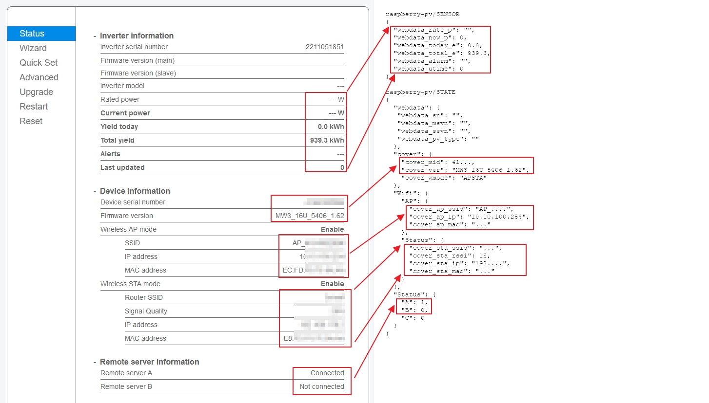

# RPi-deyesun600-to-mqtttls
poor script to provice information from deye sun 600 to mqtt broker (include tls support) as exampe hinvemq


## Installation
install all needed packages to prepare the software environtent of your Raspberry Pi:

### install required components
```bash
sudo apt install python3-paho-mqtt git -y
```

### install this tool itself:
```bash
sudo git clone https://github.com/Starwhooper/RPi-deyesun600-to-mqtttls /opt//RPi-deyesun600-to-mqtttls
sudo chmod +x /opt/RPi-deyesun600-to-mqtttls/doit.py
```

### config this tool:
```
sudo cp /opt/RPi-deyesun600-to-mqtttls/config.json.example /opt/RPi-deyesun600-to-mqtttls/config.json
sudo nano /opt/RPi-deyesun600-to-mqtttls/config.json
```
* add inverter IP Adress in
* add inverter username and password
* add broker username and password
* add broker url

### add to autostart ###
add it to cronjob reboot
```bash
sudo crontab -e
```
insert line:
```
@reboot sleep 120 && /opt/RPi-deyesun600-to-mqtttls/doit.py
```
*My raspberry zero needs 120 seconds to boot and connect to lan. Feel free to check out shorter times.*

## Update
If you already use it, feel free to update with
```bash
cd /opt/RPi-deyesun600-to-mqtttls
sudo git pull origin main
```

##Note
The deye inverter provides information not in realtime. Its provides only all 5 minutes new information on webseite or over interface. So its not really needed, to push new information in seconds rotation to broker
